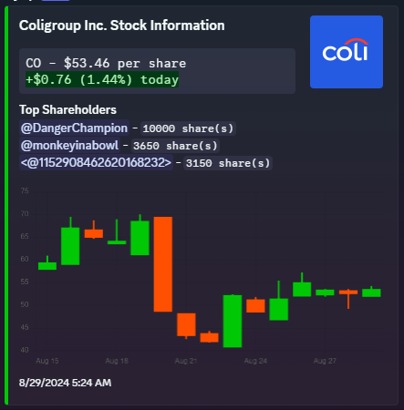
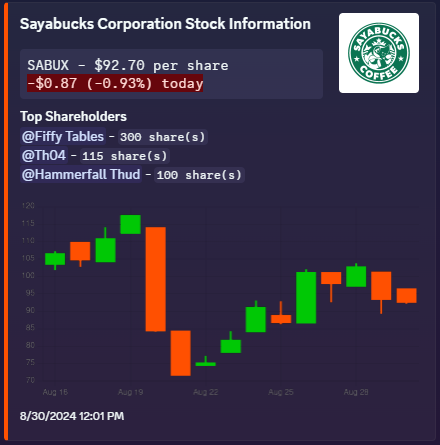
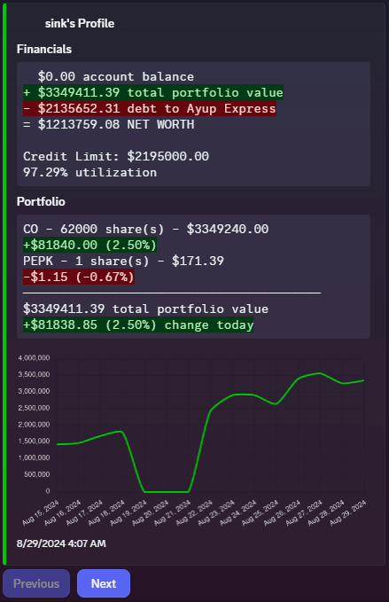
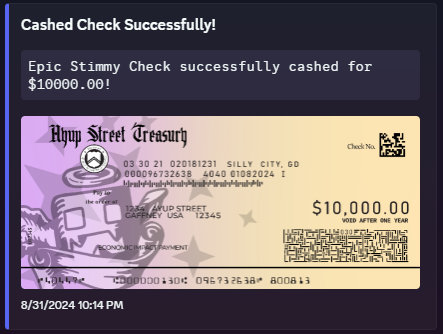

# The Wolf of Ayup

A real-time stock market simulation engine built as a Discord bot, serving **1,000+ concurrent players** trading parody stocks backed by live Yahoo Finance data. Ran as an event with fictional news articles driving market sentiment and player behavior.

  
  

## Architecture

**TypeScript / Node.js** backend with a layered service architecture:

- **DAO Layer** — Data access objects abstracting all PostgreSQL queries behind a clean interface
- **Service Layer** — Business logic (transactions, portfolio management, reward distribution) consuming DAOs via a singleton service locator with pooled connections
- **Command Layer** — Discord slash commands dynamically loaded at runtime from the filesystem
- **Cron Scheduler** — Market lifecycle automation (pre-market, open, after-hours, close) running on Eastern Time via `node-cron`

## How It Works

### Live Market Data Integration
Stock prices are **synchronized against real Yahoo Finance quotes** via `yahoo-finance2`, with a per-stock multiplier system that maps real-world ticker prices into the game's internal economy. OHLC (open/high/low/close) price history is tracked daily in PostgreSQL, powering server-rendered candlestick charts.

### Market Simulation
The bot replicates real U.S. market hours with four distinct trading phases:
- **Pre-market** (2:00 AM – 9:30 AM ET) — higher volatility, Yahoo Finance price sync
- **Regular hours** (9:30 AM – 4:00 PM ET) — standard trading
- **After-hours** (4:00 PM – 10:00 PM ET) — continued trading
- **Market close** (10:00 PM) — triggers nightly batch operations: interest accrual, credit card tier reassignment, Discord role updates, and reward distribution

### Credit & Lending System
Players receive a credit line from a fictional financial company ("Ayup Express") with **daily compounding interest**. Credit card tiers (Blue through Centurion) are reassigned nightly based on net worth percentile rank, each mapped to a Discord role for visible status.

### Server-Side Chart Rendering
Candlestick stock charts and portfolio line graphs are rendered server-side using **Chart.js** with `chartjs-node-canvas`, producing image buffers attached directly to Discord embeds — no browser or frontend required.

  
  

### Item & Collectible System
A collectible card system with weighted random pulls (booster packs), cashable checks of varying denominations, and credit cards rendered dynamically with the player's username overlaid via the **Canvas API**.

## Tech Stack

| Layer | Technology |
|---|---|
| Runtime | Node.js, TypeScript |
| Bot Framework | Discord.js 14 |
| Database | PostgreSQL (pooled connections, SSL) |
| Financial Data | Yahoo Finance API (`yahoo-finance2`) |
| Charting | Chart.js, `chartjs-node-canvas`, `chartjs-chart-financial` |
| Image Processing | node-canvas |
| Scheduling | node-cron (timezone-aware) |
| Date/Time | Luxon |

## Key Technical Details

- **49 parody stock tickers** with custom logos, each mapped to a real Yahoo Finance symbol
- Prices stored in cents (integer arithmetic) to avoid floating-point errors
- PostgreSQL connection pooling (max 20) with idle timeout management
- Timestamped stock holdings enabling historical portfolio reconstruction
- Paginated embed navigation with interactive Discord buttons and 20-second confirmation timeouts
- Transaction logging to a dedicated Discord channel for audit visibility
- Automatic database schema initialization on first run
